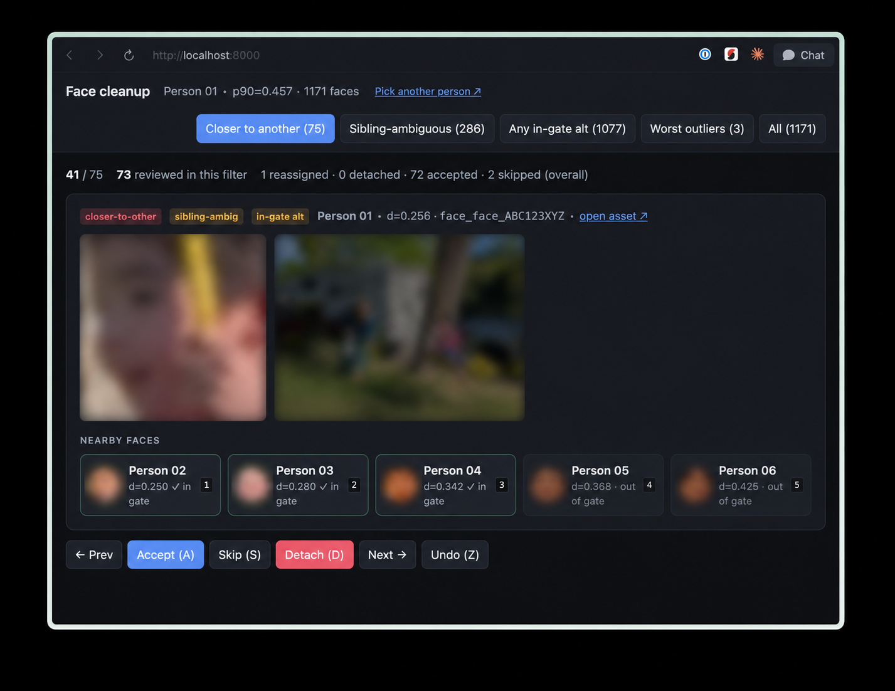
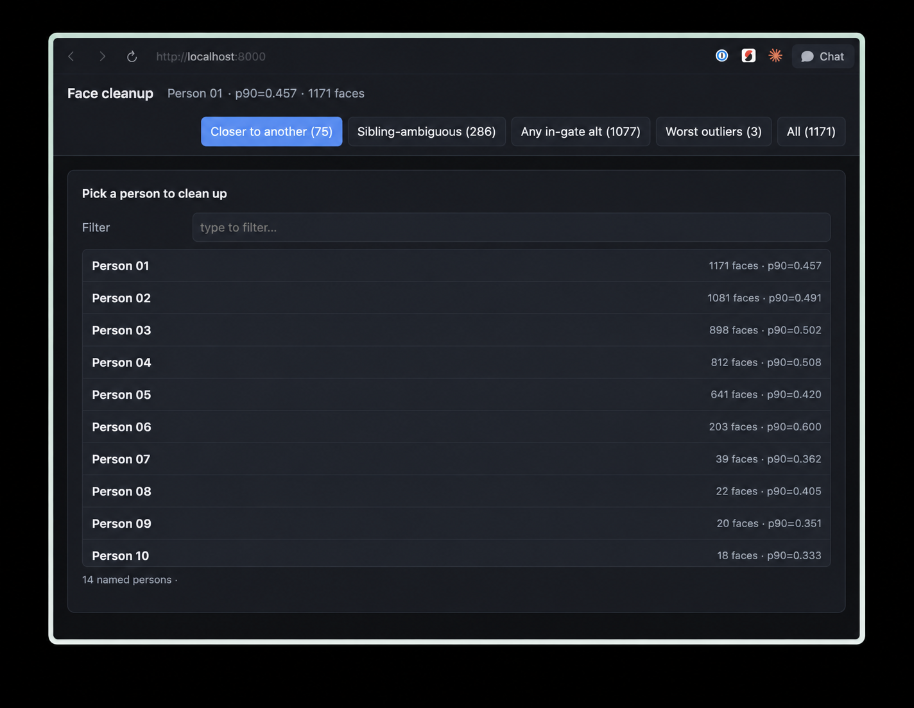

# Face cleanup

Browser-only triage UI for cleaning up a [Gumnut](https://gumnut.ai)
Person's face cluster. Useful when one Person has been polluted by
look-alikes — usually a parent/child or sibling pair — and you want to
sweep through the worst-fitting faces and reassign them.

It's a single static HTML file. No build step, no server, no
dependencies beyond a browser and a way to serve a directory locally.



> ⚠️ **Mutates your library.** This demo's main job is to call
> `PATCH /api/faces/{id}` to move faces between people (or detach them).
> Every reassignment and detach is real and immediate. There is an Undo
> (`Z`) but it only walks back the in-session history.

## Quick start

```bash
git clone https://github.com/gumnut-ai/demos.git
cd demos/face-cleanup
./run.sh
```

`run.sh` starts a local static server and opens `http://localhost:8000/`
in your browser. If you don't want the script:

```bash
python3 -m http.server 8000     # or: npx serve .
open http://localhost:8000/
```

In the page:

1. **API base URL**: leave as `https://api.gumnut.ai` (the default).
2. **API key**: paste your personal Gumnut API key. ([Get one](https://gumnut.ai).)
3. **Library**: if your account has more than one library, pick one.
   Single-library accounts skip this step.
4. **Person**: every person in the library — both **named** and
   **unnamed** clusters — laid out in a thumbnail grid, biggest cluster
   first. Type in the filter to narrow named entries down by name; clear
   the filter to see unnamed clusters. Click a card to start triaging.



The credentials, library ID, and active subject persist in
`localStorage`, so reload returns you to the same view.

## How to triage

The header tabs filter the face list. The first five tabs review faces
that are **already on the subject** — looking for misassignments to
reassign or detach. The last two tabs are the inverse: faces currently
on *other* people, or unassigned entirely, that may belong to the
subject.

| Tab | Meaning |
| --- | --- |
| Closer to another | Faces where some other named Person's centroid is **nearer** than the subject's. Highest-confidence misassignments. |
| Sibling-ambiguous | Faces where the closest *other* Person is within `sibling_margin` (0.05) of the subject's distance — production assignment picks the nearer centroid here even though next-best is barely worse. |
| Any in-gate alt | Faces where some other Person is within the production assignment distance gate (0.35). The biggest "could-have-gone-elsewhere" pool. |
| Worst outliers | Faces with `d_current` ≥ `outlier_distance` (0.45), sorted descending. Surfaces faces far from the subject's centroid even when no competing centroid is nearby — typically wrong-identity faces with no clear alternate destination. |
| All | All faces, worst-first. |
| Could be on subject | The inverse view: faces currently assigned to **other** Persons whose nearest-candidate list contains the subject AND where the subject is closer than the face's current Person. Shows up as "currently: \<other name\>" with a single "Reassign to subject" candidate button. Lazy-loaded the first time you open the tab — fans out to every neighboring Person, so it's slower than the other tabs on first click. |
| Unassigned candidates | Faces currently assigned to **no Person** (`person_id` is null) whose nearest-candidate list contains the subject — production clustering left them unassigned but still considered them close to the subject's centroid. Shows up as "currently: unassigned" with a single "Assign to subject" candidate button, sorted closest-to-subject first. Lazy-loaded on first click; walks every face in the library (no `person_id IS NULL` server-side filter), so on big libraries this is slower than the inverse tab. |

### Per-face actions

| Key | Action |
| --- | --- |
| `1`–`5` (or click a candidate) | `PATCH /api/faces/{id}` with that Person's id. |
| `D` | Detach — `PATCH /api/faces/{id}` with `person_id: null`. The face goes back to the unassigned pool and re-enters clustering on the next pass. |
| `A` | Accept — local-only mark. Confirms correctly assigned, hides the face from the list. |
| `S` | Skip — local-only mark; doesn't touch the server. |
| `Z` | Undo the most recent action, including server-side reassign/detach. |
| `←` / `→` | Navigate without acting. |

Reviewed faces are tracked in `localStorage`
(`fcd:reviewed:{personId}`, keyed per subject) so closing the tab and
coming back later doesn't make you re-walk what you've already done.
Switching subjects starts a fresh reviewed map.

After a batch of reassignments the centroid shifts; click **Pick
another person ↗** in the header and re-pick the same subject to
rebuild against the new centroid.

## What it calls

The dashboard is a pure consumer of the public API. For a chosen
subject Person it calls:

- `GET /api/people/{id}?include=cluster_metrics` — header (name, p90,
  face count).
- `GET /api/people?library_id=…&include=cluster_metrics&name_filter=all`
  — picker grid (named + unnamed), candidate-thumbnail prefetch, and
  per-candidate "cluster loose" badges.
- `GET /api/faces?person_id=…&library_id=…&include=cluster_assignment`
  (paginated) — every face on the subject, with `distance_to_person`
  and the top-K nearest other Persons in the same response. The
  **Could be on subject** tab fans the same call out across every
  neighboring Person, then keeps faces whose candidate list contains
  the subject closer than their current Person.
- `GET /api/faces?library_id=…&include=cluster_assignment` (no
  `person_id`, paginated) — every face in the library, used by the
  **Unassigned candidates** tab. Walked client-side to keep rows whose
  `person_id` is null AND whose candidate list contains the subject.
- `GET /api/faces/{id}` and `GET /api/assets?ids=…` — face-crop and
  parent-asset thumbnails plus the bbox overlay (lazy + prefetched).
- `PATCH /api/faces/{id}` — reassignments and detaches.

Per-face flags (`closer_to_other`, `sibling_ambig`,
`within_distance_gate`) are derived in the browser from the closest
*named* candidate's distance. `cluster_assignment.candidates` includes
unnamed clusters too, but unnamed clusters can't serve as a candidate
*destination* (no name to render on the button), so they're filtered
out before flag computation. The subject itself **can** be unnamed —
the picker lists both — and the standard tabs work the same against
unnamed subjects, just with `(unnamed)` in the header.

## Tuning

The thresholds at the top of `index.html` mirror the production
face-clustering constants used during assignment:

```js
const DISTANCE_GATE     = 0.35;
const COHESION_GATE     = 0.65;
const SIBLING_MARGIN    = 0.05;
const CANDIDATE_WINDOW  = 0.6;
const OUTLIER_DISTANCE  = 0.45;
```

If Gumnut tunes its production thresholds, the `Closer to another` /
`Sibling-ambiguous` / `Any in-gate alt` tabs may skew until these are
updated. The dashboard still works either way — assignment results from
the API are unchanged — only the suggestion-tab framing depends on
them. `OUTLIER_DISTANCE` is dashboard-only.

## Security

The page sends your API key on every request. **Don't host this on a
shared origin without an auth front-door** — just run it locally and
access via `localhost`. The API key only lives in your browser's
`localStorage`, and the API only ever returns data scoped to the
libraries you own.

## Layout

- `index.html` — the dashboard. Vanilla JS, ES modules, no build step.
- `run.sh` — tiny launcher: starts `python3 -m http.server` and opens
  the page.
