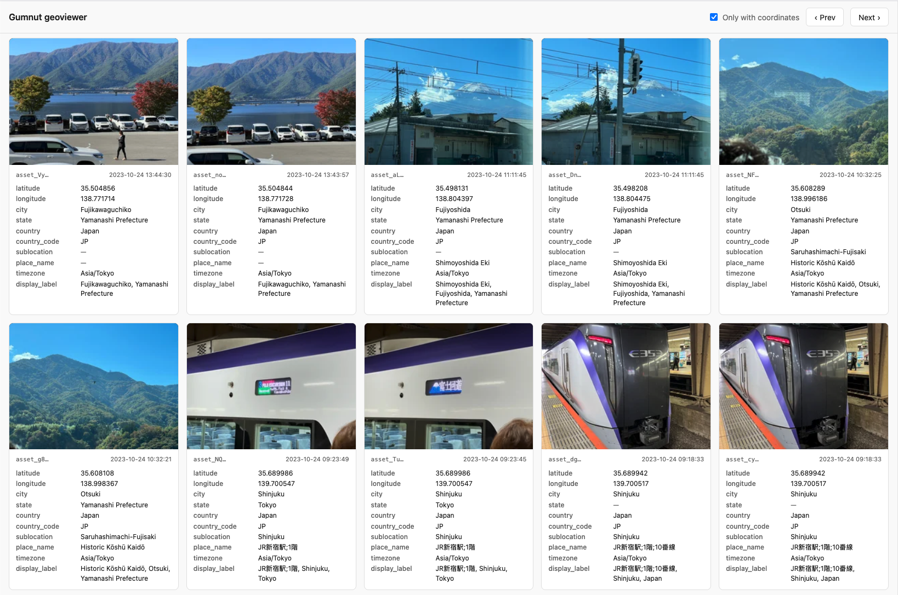

# geoviewer

Local web app to browse Gumnut assets and inspect their geo metadata.



Each asset is rendered as a card with its thumbnail and the geo fields the
Gumnut API exposes on `metadata`: `latitude`, `longitude`, `city`, `state`,
`country`, `country_code`, `sublocation`, `place_name`, `timezone`, and
`display_label`. Pages of 100 assets are loaded via cursor-based pagination,
and a "Only with coordinates" toggle hides assets that have no lat/lon.

## Setup

```sh
cp .env.example .env   # then edit .env and put your real GUMNUT_API_KEY in
npm install
npm run dev
```

Open <http://127.0.0.1:5173>.

## How it works

A small [Hono](https://hono.dev) server (`src/server.ts`) serves the static
page in `public/` and exposes two proxy endpoints so the API key never
leaves the server:

- `GET /api/assets` — forwards to `${GUMNUT_BASE_URL}/api/assets` with the
  bearer token, supporting an optional `starting_after_id` cursor.
- `GET /api/thumbnail?u=<url>` — fetches a thumbnail URL from the asset
  payload. Only `gumnut.ai` (and the configured upstream origin) are
  allowed; the API key is forwarded only to the upstream origin since
  `assets.gumnut.ai` URLs are presigned.

## Configuration

| Variable | Description |
|---|---|
| `GUMNUT_BASE_URL` | Gumnut API base URL (e.g. `https://api.gumnut.ai` or `http://localhost:8000`). |
| `GUMNUT_API_KEY` | Bearer token for the Gumnut API. |
