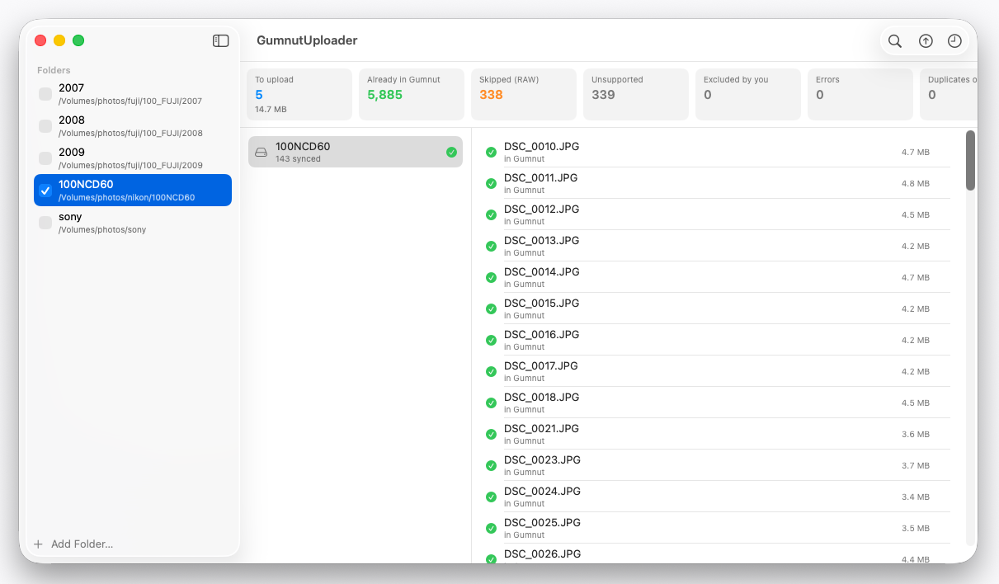

# macos-upload-client

A native macOS app (**GumnutUploader**) that one-way syncs photo and
video files from local folders — including network volumes (NAS over
SMB/NFS) — to a [Gumnut Photos](https://gumnut.ai) library. Point it at
one or more folders, review the plan it produces, and upload only the
files the library doesn't already have.



See [docs/DESIGN.md](docs/DESIGN.md) for the full design: goals, safety
guarantees, data model, and sync pipeline.

> ⚠️ **Adds to your library; never touches local files.** Uploading is a
> write — approved files are sent to your Gumnut library as new assets.
> It is *additive only*: the app has no trash/delete/update code path,
> so it can't remove or change anything already in Gumnut. And it runs
> sandboxed with read-only file access, so it is incapable of modifying
> or deleting anything on your disk. Nothing uploads without an explicit
> click.

## What it does

- **One-way sync, local → Gumnut.** Photos and videos flow from your
  folders into a single library. Never the reverse — no downloads, no
  two-way sync.
- **Content-addressed dedup.** Files are identified by streaming
  SHA-256, not by name or path. A bulk existence check
  (`POST /api/assets/exist`) asks the library which hashes it already
  has, so only the missing files upload. Re-running is always safe:
  server-side uploads are idempotent, so a retry or double-run wastes
  bandwidth but never creates a duplicate.
- **Review before upload.** Every run ends in a reviewable plan —
  summary cards plus a per-folder tree with include/exclude checkboxes.
  Uploads start only when you click. Exclusions persist across runs.
- **Built for big libraries on slow mounts.** Designed for libraries in
  the hundreds of thousands of assets, with a `(size, mtime) → sha256`
  cache so re-runs re-hash only new or changed files — the expensive
  read over a network mount happens once.
- **RAW and unsupported files are counted, not hidden.** RAW is detected
  and skipped (the API currently rejects it); sidecars and unknowns are
  tallied as "skipped" so the gap is visible rather than silent.

## Requirements

- **macOS 15+** and **Xcode 16+** (Swift 6 toolchain).
- A **Gumnut API key** — sign in at [gumnut.ai](https://gumnut.ai),
  open the dashboard, and create a personal key. You paste it into the
  app; it's stored in the macOS Keychain, never in a file or the
  database.

## Building

The project is split into an engine-independent core and the app:

- `UploaderCore/` — a Swift package with the core: embedded SQLite state
  store (GRDB), read-only file enumeration, streaming SHA-256, and the
  hand-rolled API client. Test with:

  ```sh
  cd UploaderCore && swift test
  ```

- `GumnutUploader/` — the sandboxed macOS app. Open it in Xcode:

  ```sh
  open GumnutUploader/GumnutUploader.xcodeproj
  ```

  then Run (⌘R), or build from the command line:

  ```sh
  xcodebuild -project GumnutUploader/GumnutUploader.xcodeproj \
    -scheme GumnutUploader build
  ```

## Using it (first run)

1. **Connect.** Open **Settings** (⌘,), paste your API key, and click
   **Save & Test**. If your account has more than one library, pick the
   target library here. (Self-hosting or staging? Set a custom
   server base URL in the same window; it defaults to
   `https://api.gumnut.ai`.)
2. **Add folders.** Use the roots sidebar to add one or more folders via
   the system picker — picking a folder is what grants the sandboxed app
   access to it, including folders on a mounted NAS. Each root has an
   "include in scan" checkbox; the checked set is remembered for next
   time.
3. **Analyze.** The app scans the included roots, hashes new/changed
   files, and checks them against the library. No file content has been
   uploaded yet — only hashes have left your machine.
4. **Review and upload.** Inspect the plan: how many files are already in
   Gumnut, how many are queued to upload (and how many bytes), and
   what's being skipped. Uncheck anything you don't want (exclusions
   stick for future runs), then click **Upload N (X GB)**. Cancel
   is safe at any point — all state lives in SQLite, and the next run
   picks up where you left off.

Past runs and their counters are kept in the **History** view.

## API endpoints consumed

The client (`UploaderCore/Sources/UploaderCore/Gumnut/GumnutClient.swift`)
is deliberately additive-only — these four endpoints are its entire
surface. There is no trash, delete, or update call anywhere in the app.

| Endpoint | Purpose |
| --- | --- |
| `GET /api/users/me` | Validate the API key ("Test connection"). |
| `GET /api/libraries` | List libraries, so you can pick the upload target. |
| `POST /api/assets/exist` | Bulk existence check — up to 5,000 SHA-256 checksums per request; returns the matches so only missing files upload. |
| `POST /api/assets` | Multipart upload of one file. `201` = created, `200` = identical bytes already existed (both are success). |
